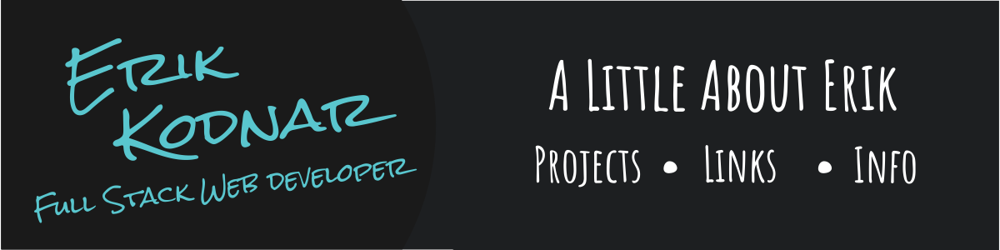

 
 
 

  

    
    

      <a href="https://www.linkedin.com/in/erikkodnar/" target="_blank">
        
      <a/>
      <a href="https://medium.com/@Erik_Kodnar" target="_blank">
        
      <a/>
      
      

        
      

    

  

    
     

   
   

  <h2 align="left">👋 Thanks for checking out my profile!</h2>

  

     
    <h3>Let's have a chat 💬 I'm interested in discussing the future of the web 🔮, New technology in <u>YOUR</u> stack 🏆, jobs 👔 for junior full stack web developers, books about programming 📖 that <u>YOU</u> love 🤟, or just about anything!! (although I do like to nerd out about ⚙️tech⚙️ specifically)  I'm open to collaboration on a variety of projects 🖥️, please see below for a brief overview of the various languages and frameworks I have had the great pleasure to learn. Included is a few of my public projects, although <a href="https://github.com/Drumshtick?tab=repositories" target="_blank">my repos</a> are also a good place to check!</h3>
  

 

<h2>⚛️ Technology, tools and frameworks</h2>

<!--- JS & CSS --->

  
    
  
  
    
  
  
    
  
  
    
  
  
    
  
  
    
  
  
    
  
  
    
  
  
    
  
  
    
  

 
<!--- DB --->

  
    
  

 

<!--- Ruby --->

  
    
  
  
    
  
  
    
  
  
    
  

 

<!--- Other Langs --->

  
    
  
  
    
  

 

<!--- Tools --->

  
    
  
  
    
  
  
    
  

